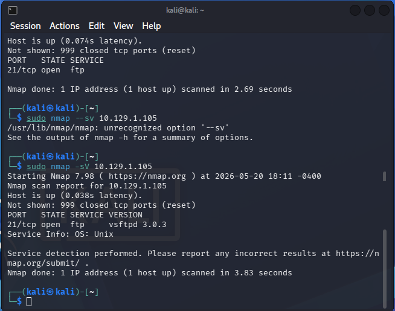
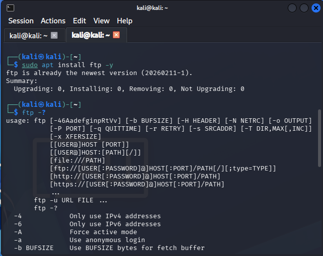
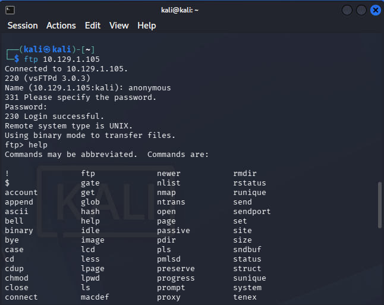
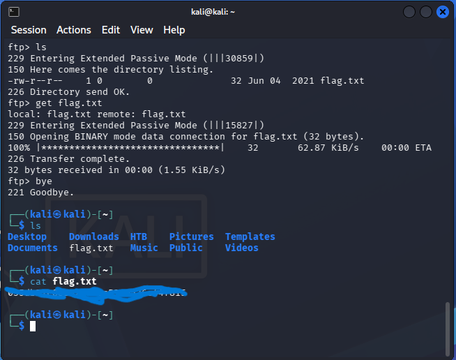

# Hack The Box - Fawn

## Objective
Gain access to the target machine using FTP and retrieve the flag.

## Tools Used

- Kali Linux
- Nmap
- FTP

## Enumeration

I began by scanning the target using:

```bash
sudo nmap -sV <target-ip>
```

The scan showed:

- Port 21/tcp open
- Service: vsftpd 3.0.3

## Exploitation

Since FTP was available, I connected to the service using:

```bash
ftp <target-ip>
```

I authenticated using the anonymous account and successfully accessed the server.

## File Enumeration

After logging in, I listed the available files:

```bash
ls
```

A file named `flag.txt` was discovered.

## Flag Retrieval

I downloaded the flag using:

```bash
get flag.txt
```

Then viewed it locally:

```bash
cat flag.txt
```

## What I Learned

- How to identify FTP services using Nmap
- How anonymous FTP authentication works
- Basic FTP commands (`ls`, `get`, `bye`)
- How to retrieve files from an FTP server

## Screenshots

- 
- 
- 
- 
